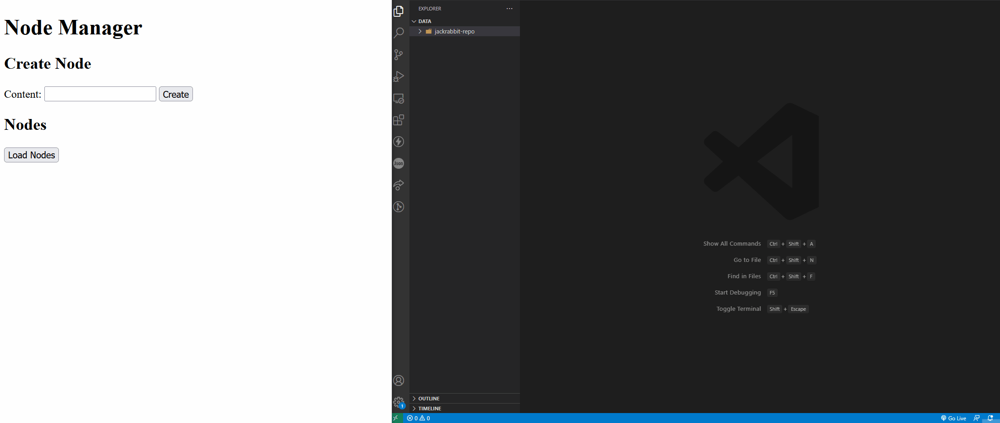

# Example Jackrabbit filevault to disk sync

In this example is to show how to sync the nodes from Jackrabbit to the file-system using jackrabbit-vault

# How?

[Jackrabbit-FileVault](https://jackrabbit.apache.org/filevault/index.html) have the popular cli tool to perform this, but we will use the EventListener approach

## Core parts:
- **RepositoryToDiskSync**: This is our implementation of TreeSync were we will give support to nodes of type mixinNodes
- **RepositoryToDiskSyncListener**: This is our EventListener that we will attach to the Jackrabbit ObservationManager, have a utility method called initializeSyncAll in case that you are working with an already existing repository
- **RepositoryToDiskSyncFactory**: This is only our Factory for translate the RepositoryToDisk configuration pojo

## Configure the example scenario
We will create a little app expose on 8080 that will be useful to create nodes with content.
You can run directly from the ide or with ./gradlew run

